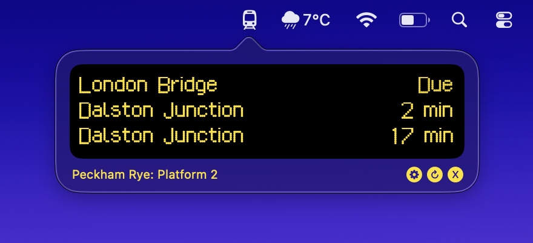
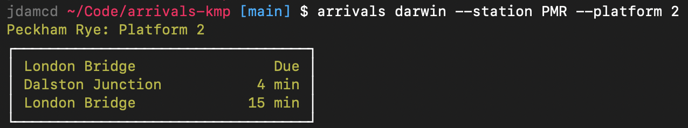

# Arrivals

Arrivals is a Kotlin Multiplatform project for live transit times. It supports 3 targets: a macOS toolbar app, a CLI, and a desktop app (tailored for Raspberry Pi kiosk displays). 



### Supported transit systems

|  | System | Source |
|--|--------|--------|
| **London** | Underground, Overground, DLR | TfL API |
| **UK** | National Rail | Darwin API |
| **NYC** | Subway | MTA GTFS |
| **SF Bay Area** | BART | 511.org GTFS |
| **Berlin** | U-Bahn, S-Bahn, Tram | transport.rest |


... or any custom [GTFS-RT feed](https://mobilitydatabase.org)

## Run

The macOS toolbar app can be downloaded from [releases](https://github.com/jdamcd/arrivals-kmp/releases) and moved to your Applications folder. Other targets need to be built from source with the instructions below.

## Build

### Prerequisites

1. Get API keys for authenticated data sources:
   - **TfL**: [Transport for London API](https://api-portal.tfl.gov.uk) app key
   - **UK National Rail**: [OpenLDBWS](https://realtime.nationalrail.co.uk/OpenLDBWSRegistration/Registration) access token
   - **BART**: [511.org](https://511.org/open-data) API key
2. Create `shared/secret.properties` and add your keys:
   ```
   tfl_key=YOURKEY
   darwin_key=YOURKEY
   org_511_key=YOURKEY
   ```
3. Make sure you have a JDK configured at `$JAVA_HOME`

### Targets

| Target | Platform | Description | Quick start |
|--------|----------|-------------|------------|
| **macOS** | macOS | SwiftUI status bar app | Open `macOS/Arrivals.xcodeproj` in Xcode and click the Run button |
| **Desktop** | Linux (incl. Raspberry Pi), macOS, Windows | Compose Multiplatform window with fullscreen mode | `./gradlew :desktop:run` |
| **CLI** | JVM (all platforms) | Command-line interface | `./cli/install` |

---

### macOS toolbar app

Native status bar application for macOS, built with SwiftUI.

1. Open `macOS/Arrivals.xcodeproj` in Xcode
2. Press the Run button
3. Configure via the settings UI

---

### Desktop window

Cross-platform desktop UI, built with Compose Multiplatform. Includes a fullscreen mode for kiosk displays and configuration via a YAML file.

#### Run from Gradle

```bash
# Windowed mode
./gradlew :desktop:run

# Fullscreen with custom dimensions
./gradlew :desktop:run --args="-pi 1280 400"
```

#### Build native distribution

```bash
# Executable in desktop/build/compose/binaries/main/app/
./gradlew :desktop:createDistributable
```

#### Configuration via YAML

Create a `.arrivals.yml` in the user home directory to configure:

```yaml
# Mode: "tfl", "darwin", "bvg", or "gtfs"
mode: tfl

# Shared fields (used by all modes)
stop: 910GSHRDHST           # Station/stop ID
platform: 2                 # Optional platform filter
line:                       # Optional line filter (BVG only, e.g. U2, S5, M10)
direction: all              # Direction filter (TfL only: "inbound", "outbound", or "all")

# GTFS-specific fields (only needed for gtfs mode)
gtfs_realtime: https://api-endpoint.mta.info/Dataservice/mtagtfsfeeds/nyct%2Fgtfs-g
gtfs_schedule: http://web.mta.info/developers/data/nyct/subway/google_transit.zip
# Optional for authenticated feeds
gtfs_api_key_param:         # Param or header (e.g. "app_id", "header:Authorization")
gtfs_api_key:               # API key
```

---

### CLI

Command-line interface (JVM required). Run `./cli/install` to install the `arrivals` command on macOS, or run it via Gradle with `./gradlew :cli:run`.



#### TfL example

```bash
arrivals tfl --station 910GSHRDHST --platform 2
```

#### Darwin (UK National Rail) example

```bash
arrivals darwin --station PMR --platform 2
```

#### BVG (Berlin) example

```bash
arrivals bvg --station 900013102 --line U8
```

#### GTFS example

```bash
arrivals gtfs --station G28S \
  --realtime https://api-endpoint.mta.info/Dataservice/mtagtfsfeeds/nyct%2Fgtfs-g \
  --schedule http://web.mta.info/developers/data/nyct/subway/google_transit.zip
```

## Attribution

* Powered by [TfL Open Data](https://api.tfl.gov.uk)
  * OS data © Crown copyright and database rights 2016
  * Geomni UK Map data © and database rights 2019
* Powered by [Rail Data Marketplace](https://raildata.org.uk) via [Huxley2](https://github.com/jpsingleton/Huxley2)
* Powered by [511 Open Data](https://511.org/open-data)
* Powered by [transport.rest](https://transport.rest) — BVG data
* Uses this [London Underground Dot Matrix Typeface](https://github.com/petykowski/London-Underground-Dot-Matrix-Typeface)
