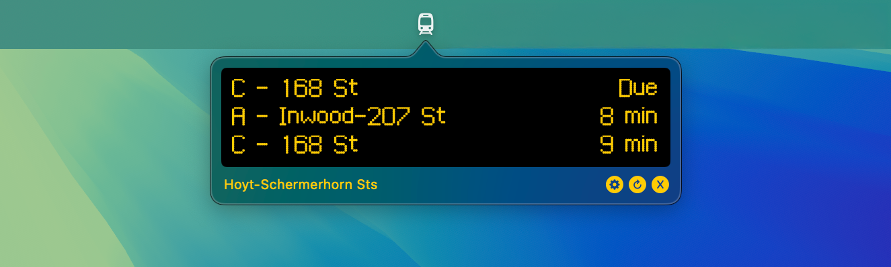

# Arrivals

Arrivals is a Kotlin Multiplatform project for live transit times. It currently supports 3 targets: a macOS toolbar app, a CLI, and a desktop app (primarily intended for Raspberry Pi kiosk displays). 



Supported data sources include:
- TfL API for London Underground, Overground, DLR, etc.
- MTA GTFS feeds for NYC Subway
- Custom GTFS feeds for other transit systems (many can be found [here](https://mobilitydatabase.org))

## Run

The macOS toolbar app can be downloaded from [releases](https://github.com/jdamcd/arrivals-kmp/releases) and moved to your Applications folder. The other targets need to be built from source with the instructions below.

## Build

### Prerequisites

1. Get a [Transport for London API](https://api-portal.tfl.gov.uk) app key (required for TfL data sources)
2. Create `shared/secret.properties` and add your key: `tfl_app_key=YOURKEY`
3. Make sure you have a JDK configured at `$JAVA_HOME`

### Targets

| Target | Platform | Description | Quick start |
|--------|----------|-------------|------------|
| **macOS** | macOS | SwiftUI status bar app | Open `macOS/Arrivals.xcodeproj` in Xcode and click the Run button |
| **Desktop** | Linux (incl. Raspberry Pi), macOS, Windows | Compose Multiplatform window with fullscreen mode | `./gradlew :desktop:run` |
| **CLI** | JVM (all platforms) | Command-line interface | `./gradlew :cli:run` |

---

### macOS toolbar app

Native status bar application for macOS, built with SwiftUI.

1. Open `macOS/Arrivals.xcodeproj` in Xcode
2. Press the Run button
3. Configure via the settings UI

---

### Desktop window

Cross-platform desktop UI, built with Compose Multiplatform. Includes a fullscreen mode for kiosk displays and configuration via a YAML file.

#### Run from Gradle

```bash
# Windowed mode
./gradlew :desktop:run

# Fullscreen with custom dimensions
./gradlew :desktop:run --args="-pi 1280 400"
```

#### Build Native Distribution

```bash
# Executable in desktop/build/compose/binaries/main/app/
./gradlew :desktop:createDistributable
```

#### Configuration via YAML

Create a `.arrivals.yml` in the user home directory to configure:

```yaml
# Mode: "tfl" or "gtfs"
mode: tfl

# TfL fields
tfl_stop: 910GSHRDHST       # Station ID
tfl_platform: Platform 2    # Optional platform filter
tfl_direction: all          # "inbound", "outbound", or "all"

# GTFS fields
gtfs_stop: G28S             # Station ID
gtfs_realtime: https://api-endpoint.mta.info/Dataservice/mtagtfsfeeds/nyct%2Fgtfs-g
gtfs_schedule: https://transitfeeds.com/p/mta/79/latest/download
```

---

### CLI

Command-line interface (uses the JVM package). Run `./gradlew :cli:run --args="--help"` for all options.

#### TfL example

```bash
./gradlew :cli:run --args="tfl --station 910GSHRDHST --platform 'Platform 2'"
```

#### GTFS example

```bash
./gradlew :cli:run --args="gtfs --stop G28S \
  --realtime https://api-endpoint.mta.info/Dataservice/mtagtfsfeeds/nyct%2Fgtfs-g \
  --schedule https://transitfeeds.com/p/mta/79/latest/download"
```

## Attribution

* Uses this [London Underground Typeface](https://github.com/petykowski/London-Underground-Dot-Matrix-Typeface) for dot matrix text
* Powered by TfL Open Data
  * OS data © Crown copyright and database rights 2016
  * Geomni UK Map data © and database rights 2019
